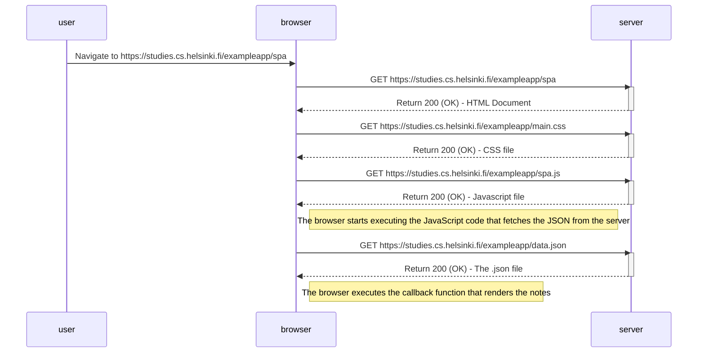

```mermaid
sequenceDiagram
    participant user
    participant browser
    participant server

user->>browser: Navigate to https://studies.cs.helsinki.fi/exampleapp/spa
browser->>server: GET https://studies.cs.helsinki.fi/exampleapp/spa
activate server
server-->>browser: Return 200 (OK) - HTML Document
deactivate server

browser->>server: GET https://studies.cs.helsinki.fi/exampleapp/main.css
activate server
server-->>browser: Return 200 (OK) - CSS file
deactivate server

browser->>server: GET https://studies.cs.helsinki.fi/exampleapp/spa.js
activate server
server-->>browser: Return 200 (OK) - Javascript file
deactivate server

Note right of browser: The browser starts executing the JavaScript code that fetches the JSON from the server

browser->>server: GET https://studies.cs.helsinki.fi/exampleapp/data.json
activate server
server-->>browser: Return 200 (OK) - The .json file
deactivate server

Note right of browser: The browser executes the callback function that renders the notes
```