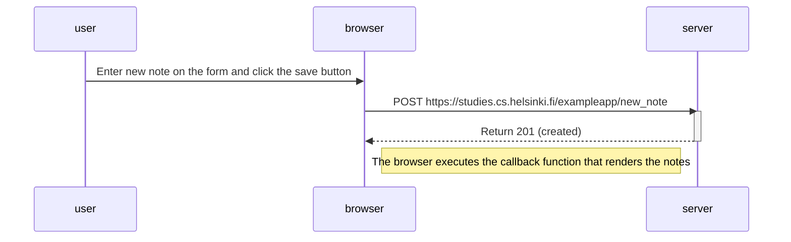

```mermaid
sequenceDiagram
    participant user
    participant browser
    participant server

user->>browser: Enter new note on the form and click the save button
browser->>server: POST https://studies.cs.helsinki.fi/exampleapp/new_note
activate server
server-->>browser: Return 201 (created)
deactivate server

Note right of browser: The browser executes the callback function that renders the notes
```